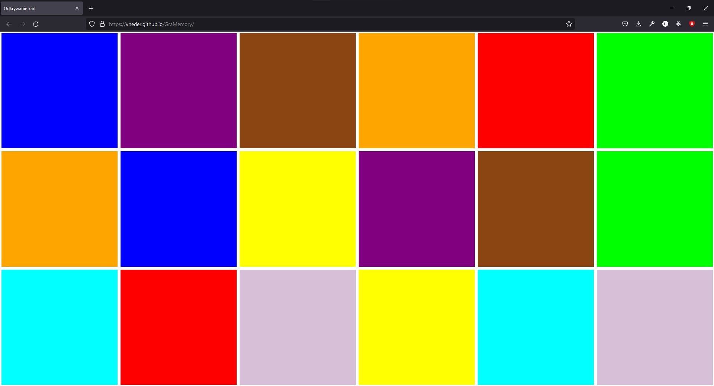
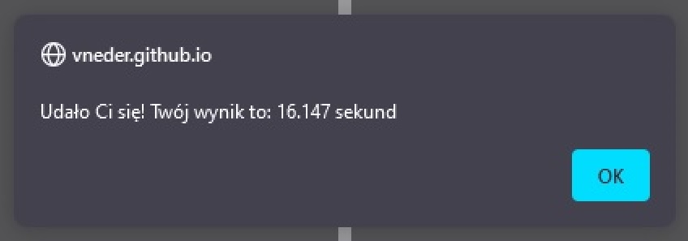

<h1 alig="center">
  

     MemoryGame
  

</h1>

* [Live](#live)
* [Technologies](#technologies)
* [General info](#general-info)
* [Screenshots](#screenshots)
* [Contact](#contact)

## Live
<h3> https://vneder.github.io/GraMemory/ </h3>

## Technologies
Project is created with:
* HTML
* CSS (RWD)
* JavaScript

## General info
* Po otworzeniu strony przez chwilkę widzimy wszystki kolory pod kartami
* Następnie wszytkie zmieniają kolor na szary
* Naszym zadaniem jest znalezienie dwóch tych samych kolorów przez kliknięcie
* Po odkryciu całej strony wyskakuje alert z naszym czasem

## Screenshots

  

  

  

  

## Contact
* E-mail: lukasz.wozniakowski21@gmail.com
* LinkedIn: https://www.linkedin.com/in/lukasz-wozniakowski21/
